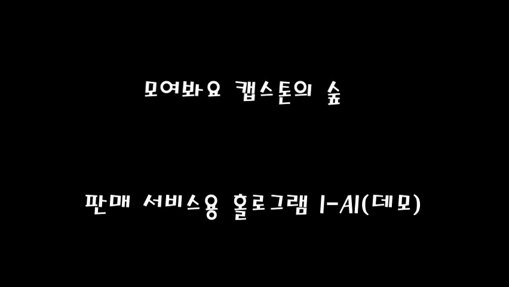

# Legacy Unity Portfolio Showcase

> 2018-2020년에 제작했던 Unity 기반 학습/과제/해커톤 프로젝트를 공개 포트폴리오용으로 정리한 쇼케이스입니다.

## 🧭 프로젝트 한눈에 보기

| 프로젝트 | 기간 | 키워드 |
| --- | --- | --- |
| I-AI | 2020 | 홀로그램 AI, 음성/영상 인식, 서비스 데모 |
| VI-HO | 2020 | 혼합현실, 병실형 3D 공간, 포즈/카메라 실험 |
| MYO Archery | 2018-2019 | MYO 암밴드, 센서 입력, 3D 활쏘기 |
| Recall | 2019 | VR/센서 입력, 체험형 인터랙션 |
| Capstone Forest | 2020 | 캡스톤, 숲/맵 기반 데모, 발표용 프로토타입 |
| MoveLogic | 2019 | 게임콘텐츠 수업, 모바일형 Unity 데모 |

## 🔗 주요 링크

- 웹 쇼케이스: [docs/index.html](docs/index.html)
- 원본 소스: 외부 에셋 라이선스와 대용량 파일 이슈 때문에 private archive로 보관
- 공개 범위: 스크린샷, 구현 요약, 복원 메모만 공개

## 🖼️ 대표 화면

## ✨ 공개용으로 분리한 이유

원본 Unity 프로젝트에는 Asset Store/free asset, SDK, 네이티브 플러그인, 모델 파일, 빌드 산출물 등이 섞여 있습니다. 그래서 원본 저장소 전체를 public으로 여는 대신, 포트폴리오 검토자가 확인해야 하는 결과 화면과 구현 맥락만 이 저장소에 분리했습니다.

## 🛠️ 기술 스택

| 기술 | 사용 맥락 |
| --- | --- |
| Unity | 3D 씬, 입력 처리, 프로토타입 빌드 |
| C# | 게임 로직과 인터랙션 흐름 구현 |
| OpenCV/YOLO/STT/MYO 등 | 프로젝트별 실험 기능 구현에 활용 |

## 🧩 I-AI

| 항목 | 내용 |
| --- | --- |
| 한 줄 설명 | 판매 서비스용 홀로그램 AI 데모 |
| 작업 시기 | 2020 |
| 엔진 | Unity 2019.3.12f1 |
| 역할 | Unity 프로토타입, 3D 씬 구성, 멀티모달 기능 실험 |

음성, 영상, 객체 인식, 3D 캐릭터 표현을 결합해 매장 안내형 인터랙션을 실험한 캡스톤/해커톤 프로젝트입니다.

- Unity 씬과 캐릭터를 중심으로 서비스 안내 흐름 구성
- OpenCV/YOLO/STT 관련 자료를 결합한 실험형 구조
- 시연 영상 프레임을 보존해 결과 화면을 빠르게 확인 가능

## 🧩 VI-HO

| 항목 | 내용 |
| --- | --- |
| 한 줄 설명 | 실감형 혼합현실 데모 |
| 작업 시기 | 2020 |
| 엔진 | Unity 2019.3.12f1 |
| 역할 | 혼합현실 씬 구성, 카메라/포즈 인식 실험, 데모 제작 |

병실형 3D 공간, 캐릭터, 영상 입력/포즈 추정 관련 에셋을 묶어 체험형 혼합현실 흐름을 실험한 Unity 프로젝트입니다.

- 병실 공간과 캐릭터를 이용한 체험형 시나리오 구성
- OpenCVForUnity, Barracuda/pose 관련 자료 기반의 프로토타입
- 시연 영상에서 핵심 화면을 추출해 포트폴리오 미리보기로 정리

## 🧩 MYO Archery

> 실행 캡처 없음: MYO 장치/런타임 의존성이 있어 현재는 소스 구조와 복원 상태만 공개합니다.

| 항목 | 내용 |
| --- | --- |
| 한 줄 설명 | MYO 암밴드 연동 활쏘기 게임 |
| 작업 시기 | 2018-2019 |
| 엔진 | Unity 2018.2.16f1 |
| 역할 | 센서 입력 연동, Unity 게임 씬 구성, 빌드 산출물 보존 |

MYO 암밴드 입력을 Unity 게임 조작에 연결했던 활쏘기 실험 프로젝트입니다. 현재는 장치/런타임 의존성 때문에 공개 캡처 대신 구조와 복원 상태를 중심으로 정리했습니다.

- MYO SDK/플러그인과 Unity 씬을 결합한 센서 입력 실험
- 활, 과녁, 숲 환경을 사용하는 3D 게임 형태
- 장치 의존 프로젝트를 원본 소스와 빌드 기준으로 보존

## 🧩 Recall

| 항목 | 내용 |
| --- | --- |
| 한 줄 설명 | VR/센서 기반 상호작용 데모 |
| 작업 시기 | 2019 |
| 엔진 | Unity 2018.2.16f1 |
| 역할 | VR/센서 입력 흐름 구성, 시연 환경 제작 |

VR 장비와 손/센서 입력을 활용한 체험형 Unity 데모입니다. 실제 착용/조작 시연 자료가 남아 있어 인터랙션 흐름을 보여주기 좋습니다.

- 실제 착용/조작 장면이 포함된 시연 영상 보존
- Unity 씬, 프리팹, 스크립트를 프로젝트 단위로 분리 백업
- 구형 장비 의존 프로젝트의 복원 조건을 문서화

## 🧩 Capstone Forest

| 항목 | 내용 |
| --- | --- |
| 한 줄 설명 | 모여봐요 캡스톤의 숲 데모 |
| 작업 시기 | 2020 |
| 엔진 | Unity 2018.2.16f1 |
| 역할 | 캡스톤 데모 제작, 씬 구성, 발표용 시연 자료 정리 |

숲/맵 기반 공간과 음성·상호작용 아이디어를 결합한 캡스톤/K-해커톤 Unity 데모입니다.

- 발표용 데모 영상 기반 핵심 화면 보존
- Unity 씬과 스크립트를 별도 저장소로 분리
- 오래된 과제형 프로젝트를 포트폴리오 설명 가능한 형태로 재구성

## 🧩 MoveLogic

| 항목 | 내용 |
| --- | --- |
| 한 줄 설명 | Unity 게임콘텐츠 수업 데모 |
| 작업 시기 | 2019 |
| 엔진 | Unity 2018.2.16f1 |
| 역할 | 게임 로직 구현, 모바일형 화면 데모 제작 |

모바일 세로 화면 비율의 작은 Unity 게임콘텐츠 프로젝트입니다. 이동/상호작용 로직과 데모 영상을 중심으로 보존했습니다.

- 작은 규모의 Unity 게임 로직을 독립 프로젝트로 정리
- 모바일형 세로 화면 시연 영상을 이미지로 변환
- 구형 Unity 프로젝트의 최소 복원 단계를 문서화

## ✅ 확인한 것

- 각 원본 프로젝트의 Unity 버전 파일 확인
- 공개 가능한 시연 이미지 추출 및 정리
- 원본 소스 repo는 라이선스/재배포 리스크 때문에 private 유지
- 공개 README에서 로컬 경로와 private repo 링크 제거

## ⚠️ 한계

이 저장소는 오래된 프로젝트의 public showcase입니다. 최신 Unity에서 바로 실행되는 완성형 제품 저장소가 아니며, 원본 소스와 외부 에셋은 재배포하지 않습니다.
