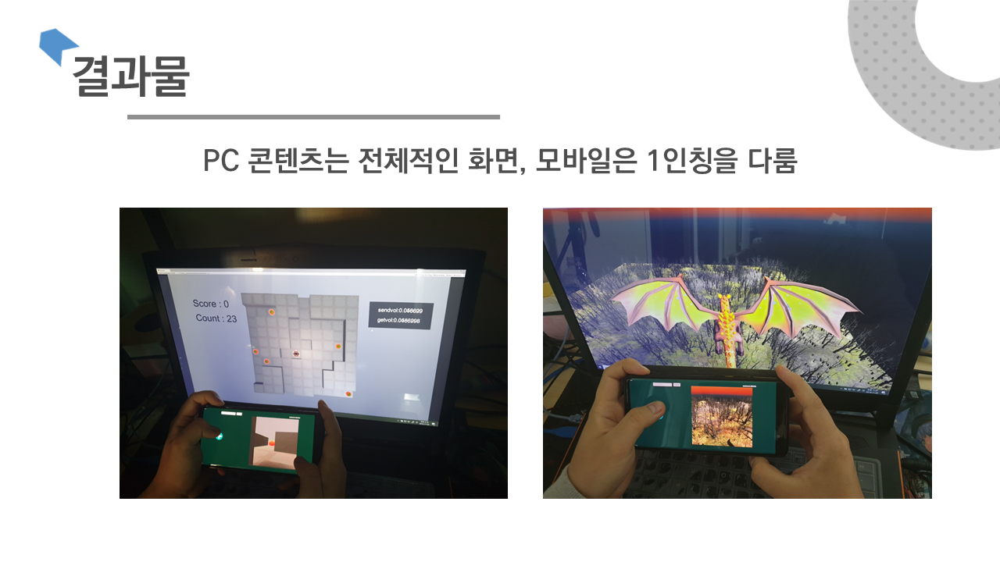
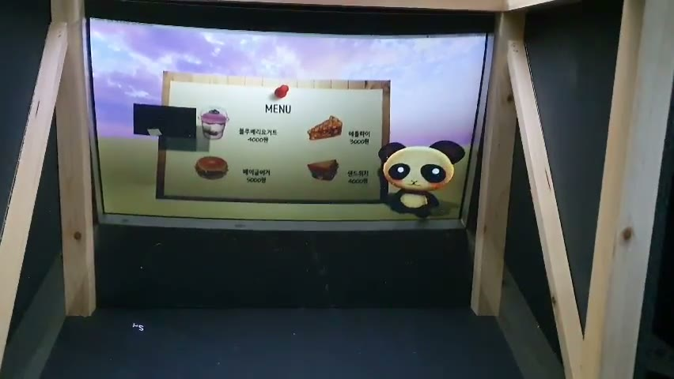

# Unity 센서 인터랙션 포트폴리오

> 스마트폰, MYO 암밴드, VR HMD, 카메라 인식을 Unity 콘텐츠의 입력과 화면 반응으로 바꾼 2019-2020 프로젝트입니다.

## 🧭 프로젝트 한눈에 보기

| 프로젝트 | 역할 | 내가 만든 핵심 | 결과 |
| --- | --- | --- | --- |
| MSmote | 4인 팀장 · 프로젝트 원안 | 전체 기획, 멀티스크린 구조, Decibel Play 단독 구현 | 수상 2건 · 저작권 C-2020-002275 |
| MYO Archery | 1인 기획·개발 | MYO 팔 방향 조준, 발사·점수·종료 흐름, Windows build | 3일 개발 · 전북 과학축전 부스 메인 콘텐츠 |
| I-AI | 3인 팀장 | 손동작 데이터 수집·라벨링, YOLO 학습, Unity UI 연결 | K-해커톤 본선 |
| Recall | 3인 팀장 | 학과 전용 강의실 3D 모델링, 체험 시나리오·팀 통합 | VR·MYO 방 탈출 시연 |

## 🔗 주요 링크

| 결과물 | 링크 |
| --- | --- |
| MYO Archery 전시 영상 | [60초 현장 시연](https://song991123.github.io/portfolio-assets/videos/myo-archery-forest-arrow-exhibition.mp4) |
| MYO Archery Windows build | [ZIP 다운로드](builds/myo-archery-windows.zip) |
| 노션 포트폴리오 | [전체 프로젝트 갤러리](https://marenblog.notion.site/Backend-Full-stack-Developer-38ff5ac8065c81f1bffbc2bd48b0e081) |

## 🏆 MSmote · 스마트폰 게임 컨트롤러

스마트폰의 화면, 조이스틱, 마이크, 자이로를 PC 게임 입력으로 쓰는 아이디어와 두 게임의 콘텐츠 구조를 제안했습니다. 팀장으로 4인의 입력 모듈을 통합했고, 마이크 음량으로 오브젝트를 모으는 `Decibel Play`의 자동 스테이지, 제한 시간, 점수 UI와 플레이 규칙을 단독 구현했습니다.

- 2019 캡스톤디자인 경진대회 최우수상
- 2019 기업연계 캡스톤디자인 은상
- 플레이 컨트롤러 저작권 등록 `C-2020-002275`

[노션에서 MSmote 상세 보기](https://marenblog.notion.site/3a3f5ac8065c814a9f33c815482d9efb)

## 🏹 MYO Archery · 3일 단독 개발

MYO 암밴드의 팔 방향을 활 조준에 연결하고 발사, 화살 충돌, 점수와 게임 종료까지 구현한 Unity 양궁 게임입니다. 기획부터 Windows build까지 3일 동안 혼자 완성했고, 원광대학교 디콘 동아리 부스로 참여한 전북 과학축전에서 관람객이 반복 체험하는 메인 콘텐츠로 운영했습니다.

- MYO 팔 방향 → 활 조준
- 별도 입력 → 화살 발사
- 과녁·이동 표적 충돌, 점수, Game End와 재시작
- [Windows build 다운로드](builds/myo-archery-windows.zip)
- [전시 영상 보기](https://song991123.github.io/portfolio-assets/videos/myo-archery-forest-arrow-exhibition.mp4)

[노션에서 MYO Archery 상세 보기](https://marenblog.notion.site/3a3f5ac8065c8178af11d8c7bbcc1bcc)

## 🤖 I-AI · 손동작 기반 안내 프로토타입

3인 팀장으로 매장 안내 서비스의 흐름과 Unity 통합을 이끌었습니다. 손동작 이미지 1,068장을 수집하고 색상 기반 이미지 146장을 직접 라벨링한 뒤, YOLO 계열 모델의 인식 결과를 메뉴 UI와 상품 모델 반응으로 연결했습니다. 팀의 음성·애니메이션 모듈을 유사 홀로그램 시연에 합쳐 K-해커톤 본선에 진출했습니다.

[노션에서 I-AI 상세 보기](https://marenblog.notion.site/3a3f5ac8065c818aabf3d43520ea0e40)

## 🥽 Recall · 실제 강의실을 옮긴 VR 방 탈출

학과 전용 강의실의 구조와 배치를 직접 3D 모델링해 VR 방 탈출 맵으로 만들었습니다. 3인 팀장으로 HMD 시점, MYO·마이크 입력, 퍼즐과 비주얼 노벨 흐름을 한 체험 시나리오로 통합해 실제 장비 시연까지 완성했습니다.

[노션에서 Recall 상세 보기](https://marenblog.notion.site/3a3f5ac8065c81e0b741dc1baba4385e)

## 🛠️ 기술과 역량

| 영역 | 적용 경험 |
| --- | --- |
| Unity / C# | 3D 장면, 게임 상태, 충돌·점수, UI, Windows build |
| 센서 입력 | MYO 팔 방향과 마이크 음량을 게임 규칙으로 변환 |
| 모바일 연동 | PC 전체 화면과 Android 1인칭 화면, 조이스틱·자이로·마이크 입력 통합 |
| AI 인터랙션 | 데이터 수집·라벨링, YOLO/OpenCV 추론, 인식 결과와 Unity UI 연결 |
| VR / 3D | 실제 강의실 모델링, HMD 시점과 센서 기반 퍼즐 체험 구성 |
