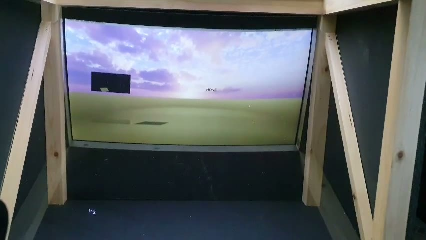
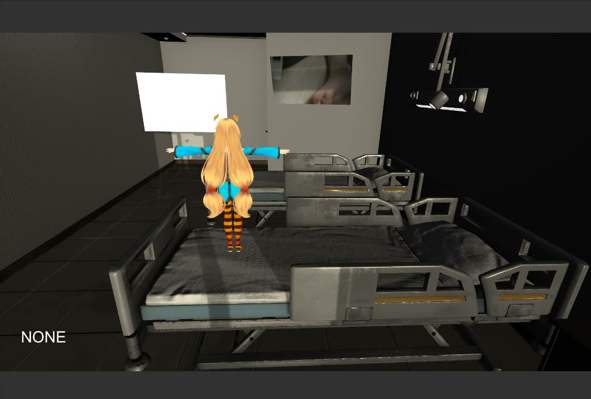
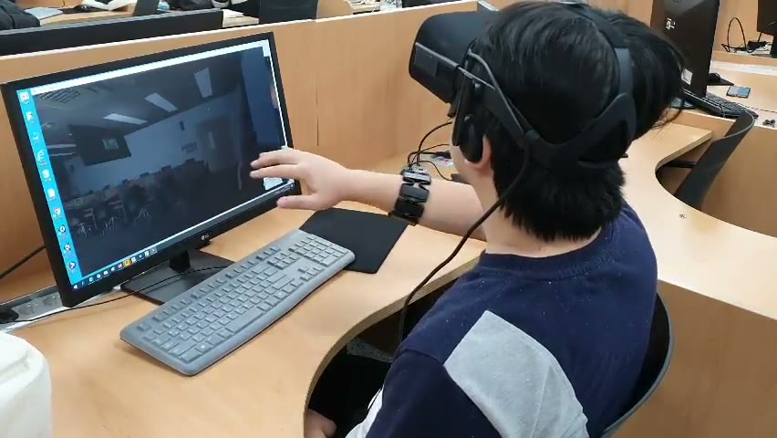

# Unity 실감형 인터랙션 아카이브

> 2018-2020년에 Unity로 제작했던 AI, 혼합현실, VR/센서 기반 인터랙션 프로토타입을 공개 가능한 화면과 설명 중심으로 정리한 포트폴리오입니다.

## 🧭 프로젝트 한눈에 보기

| 프로젝트 | 시기 | 핵심 경험 | 포트폴리오 포인트 |
| --- | --- | --- | --- |
| I-AI | 2020 | 음성/영상 인식, 3D 캐릭터, 서비스형 데모 | AI 인터랙션을 Unity 화면으로 연결한 대표 사례 |
| VI-HO | 2020 | 혼합현실, 병실형 3D 공간, 카메라/포즈 인식 실험 | 공간 기반 실감형 콘텐츠 제작 경험 |
| Recall | 2019 | VR 장비, 센서 입력, 실제 착용 시연 | 물리 장비 기반 상호작용 경험 |

## 🔗 주요 링크

| 자료 | 설명 |
| --- | --- |
| GitHub README | 이 저장소의 첫 화면이 공개 포트폴리오 본문입니다. |
| 원본 Unity 프로젝트 | 외부 에셋과 SDK가 섞여 있어 private archive로 별도 보관합니다. |
| 공개 이미지 | `docs/assets/`에 대표 프로젝트 캡처만 포함했습니다. |

## 🖼️ 대표 화면

### I-AI

매장 안내형 홀로그램 AI를 목표로 만든 Unity 프로토타입입니다. 음성, 영상, 객체 인식, 3D 캐릭터 표현을 한 흐름 안에서 연결해 보며 서비스형 인터랙션을 실험했습니다.

- Unity 씬과 캐릭터를 중심으로 안내 흐름 구성
- OpenCV, YOLO, STT 관련 자료를 결합한 멀티모달 실험
- 캡스톤/해커톤 성격의 프로젝트라 문제 정의와 시연 맥락을 설명하기 좋음

### VI-HO

병실형 3D 공간에서 캐릭터와 영상 입력을 결합해 본 혼합현실 데모입니다. 카메라 입력, 포즈 추정, 공간 연출을 Unity 안에서 실험한 프로젝트입니다.

- 병실 공간과 캐릭터를 이용한 체험형 시나리오 구성
- OpenCVForUnity, Barracuda/pose 계열 자료 기반 프로토타입
- I-AI와 달리 공간/카메라 기반 실감형 콘텐츠 경험을 보여줌

### Recall

VR 장비와 손/센서 입력을 활용한 체험형 Unity 데모입니다. 실제 착용하고 조작하는 시연 자료가 남아 있어 물리 장비 기반 상호작용 경험을 보여주는 보조 사례로 정리했습니다.

- 실제 착용/조작 장면이 포함된 시연 자료 보존
- VR/센서 입력을 Unity 씬과 연결한 실험
- 구형 장비 의존 프로젝트의 복원 조건을 별도 private archive에 보관

## ✨ 구현 경험

| 경험 | 설명 |
| --- | --- |
| Unity 3D 씬 구성 | 캐릭터, 공간, 카메라, 조명, 프리팹을 조합해 시연 가능한 장면 구성 |
| 입력/인식 연동 | 음성, 영상, 포즈, 센서 입력을 Unity 상호작용 흐름에 연결하는 실험 |
| 데모 제작 | 발표와 시연을 위한 빌드, 영상, 화면 자료 구성 |
| 구형 프로젝트 복원 | Unity 2018/2019 프로젝트를 분리 백업하고 공개 가능한 자료만 정리 |

## 🛠️ 기술 스택

| 기술 | 사용 맥락 |
| --- | --- |
| Unity 2018/2019 | 3D 씬, 인터랙션, 빌드 산출물 제작 |
| C# | Unity 게임 로직과 입력 처리 흐름 구현 |
| OpenCV/YOLO/STT | 영상/객체/음성 인식 실험 자료 연동 |
| VR/MYO 계열 장비 | 센서 입력과 물리 조작 기반 상호작용 실험 |

## 🔒 공개 범위

이 저장소에는 포트폴리오 검토에 필요한 설명과 공개 가능한 캡처 이미지만 포함했습니다. 원본 Unity 프로젝트에는 외부 에셋, SDK, 모델 파일, 빌드 산출물이 섞여 있어 별도 private archive로 보관합니다.

소스 전체가 아니라 쇼케이스만 공개한 이유는 재배포 권한이 불명확한 에셋을 피하면서도, 당시 어떤 인터랙션을 구현해 보았는지 빠르게 보여주기 위해서입니다.

## 📦 별도 보관 자료

아래 프로젝트들은 원본 백업에는 남겨두되, 공개 포트폴리오 첫 화면에서는 제외했습니다.

| 프로젝트 | 제외 이유 |
| --- | --- |
| Capstone Forest | I-AI와 캡스톤/시연 맥락이 겹쳐 대표성이 약함 |
| MYO Archery | 실행 캡처가 없어 장비 재촬영 전까지 공개 카드로 쓰기 어려움 |
| MoveLogic | 작은 수업 과제 성격이 강해 대표 포트폴리오로는 임팩트가 약함 |
