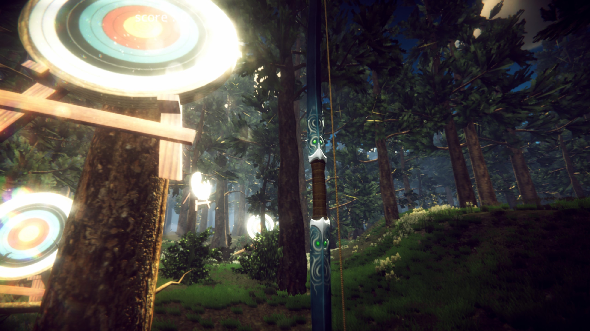

# Unity 인터랙션 게임/데모 아카이브

> 2018-2020년에 Unity로 제작했던 센서 연동 게임, AI 데모, VR 인터랙션 프로젝트를 공개 가능한 화면과 설명 중심으로 정리한 포트폴리오입니다.

## 🧭 프로젝트 한눈에 보기

| 프로젝트 | 시기 | 핵심 경험 | 포트폴리오 포인트 |
| --- | --- | --- | --- |
| MYO Archery | 2018-2019 | 3일 단독 개발, MYO 암밴드 입력, 3D 활쏘기 게임 | 원광대 디콘 동아리 부스 메인 콘텐츠로 사용된 실행형 게임 |
| I-AI | 2020 | 음성/영상 인식, 3D 캐릭터, 서비스형 데모 | AI 인터랙션을 Unity 화면으로 연결한 대표 사례 |
| Recall | 2019 | VR 장비, 센서 입력, 실제 착용 시연 | 물리 장비 기반 상호작용 경험 |

## 🔗 주요 링크

| 자료 | 설명 |
| --- | --- |
| GitHub README | 이 저장소의 첫 화면이 공개 포트폴리오 본문입니다. |
| MYO Archery Windows 빌드 | [builds/myo-archery-windows.zip](builds/myo-archery-windows.zip) |
| 공개 이미지 | `docs/assets/`에 대표 프로젝트 캡처만 포함했습니다. |

## 🎯 MYO Archery

MYO 암밴드 입력을 활용해 활을 조작하는 3D 활쏘기 게임입니다. 원광대 디지털콘텐츠 관련 동아리 활동 중 3일 동안 단독 개발했고, 이후 전시 부스에서 메인 콘텐츠로 사용했습니다. 숲 배경, 과녁, 활 오브젝트, 점수 UI를 갖춘 실행 가능한 Unity 빌드가 남아 있어 오래된 프로젝트 중에서도 가장 직접적으로 보여줄 수 있는 결과물입니다.

| 항목 | 내용 |
| --- | --- |
| 개발 기간 | 3일 |
| 제작 방식 | 단독 개발 |
| 사용 장치 | MYO 암밴드 |
| 공개 빌드 | [Windows build zip](builds/myo-archery-windows.zip) |

- 3일 동안 단독 제작한 Unity 게임 프로젝트
- 원광대 디콘 동아리 활동 전시 부스의 메인 콘텐츠로 활용
- MYO 센서 입력을 게임 조작 흐름에 연결
- 과녁, 활, 숲 배경을 이용한 3D 플레이 장면 구성
- 현재 PC에서 빌드를 실행해 공개용 캡처 확보

## 🤖 I-AI

매장 안내형 홀로그램 AI를 목표로 만든 Unity 프로토타입입니다. 음성, 영상, 객체 인식, 3D 캐릭터 표현을 한 흐름 안에서 연결해 보며 서비스형 인터랙션을 실험했습니다.

| 항목 | 내용 |
| --- | --- |
| 작업 시기 | 2020 |
| 성격 | 캡스톤/해커톤형 Unity AI 데모 |
| 공개 범위 | 화면 캡처와 구현 설명만 공개 |

- Unity 씬과 캐릭터를 중심으로 안내 흐름 구성
- OpenCV, YOLO, STT 관련 자료를 결합한 멀티모달 실험
- 캡스톤/해커톤 성격의 프로젝트라 문제 정의와 시연 맥락을 설명하기 좋음

## 🥽 Recall

VR 장비와 손/센서 입력을 활용한 체험형 Unity 데모입니다. 실제 착용하고 조작하는 시연 자료가 남아 있어 물리 장비 기반 상호작용 경험을 보여주는 보조 사례로 정리했습니다.

| 항목 | 내용 |
| --- | --- |
| 작업 시기 | 2019 |
| 성격 | VR/센서 기반 상호작용 데모 |
| 공개 범위 | 화면 캡처와 구현 설명만 공개 |

- 실제 착용/조작 장면이 포함된 시연 자료 보존
- VR/센서 입력을 Unity 씬과 연결한 실험
- 구형 장비 의존 프로젝트의 복원 조건을 별도 private archive에 보관

## 🧩 구현 경험

| 경험 | 설명 |
| --- | --- |
| 센서 연동 게임 제작 | MYO 암밴드 입력을 Unity 게임 조작에 연결 |
| Unity 3D 씬 구성 | 캐릭터, 공간, 카메라, 조명, 프리팹을 조합해 시연 가능한 장면 구성 |
| 입력/인식 연동 | 음성, 영상, 포즈, 센서 입력을 Unity 상호작용 흐름에 연결하는 실험 |
| 데모 제작 | 발표와 시연을 위한 빌드, 영상, 화면 자료 구성 |
| 구형 프로젝트 복원 | Unity 2018/2019 프로젝트를 분리 백업하고 공개 가능한 자료만 정리 |

## 🛠️ 기술 스택

| 기술 | 사용 맥락 |
| --- | --- |
| Unity 2018/2019 | 3D 씬, 인터랙션, 빌드 산출물 제작 |
| C# | Unity 게임 로직과 입력 처리 흐름 구현 |
| MYO SDK | 암밴드 센서 입력을 게임 조작에 연결 |
| OpenCV/YOLO/STT | 영상/객체/음성 인식 실험 자료 연동 |
| VR 장비 | 물리 조작 기반 상호작용 실험 |

## 🔒 공개 범위

이 저장소에는 포트폴리오 검토에 필요한 설명, 공개 가능한 캡처 이미지, 그리고 MYO Archery 실행 빌드만 포함했습니다. 원본 Unity 프로젝트 소스는 외부 에셋, SDK, 모델 파일이 섞여 있어 별도 private archive로 보관합니다.

I-AI와 Recall은 실행 빌드보다 프로젝트 화면과 구현 맥락을 보여주는 용도로만 공개했습니다.
